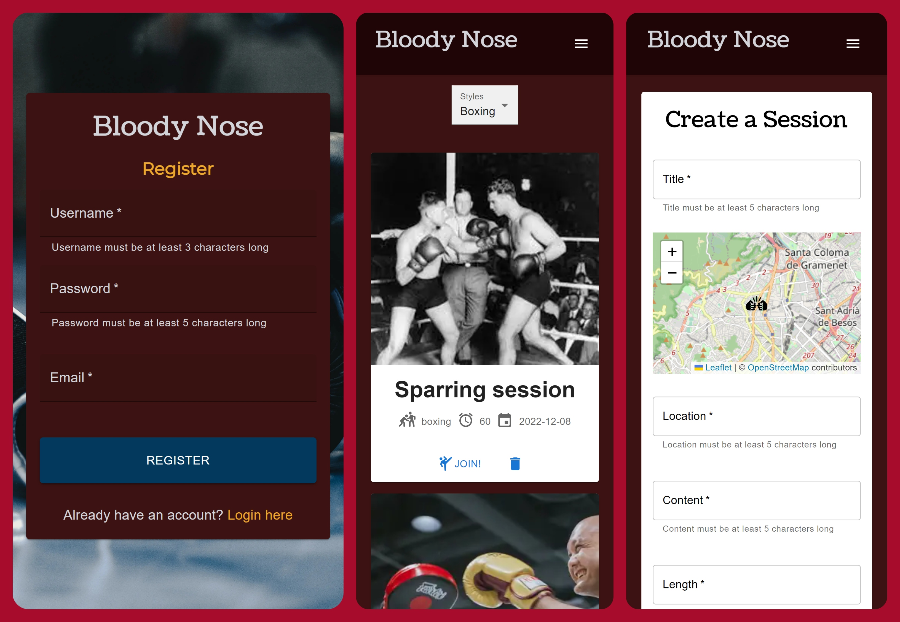

# Bloody Nose

     

> Find your perfect martial arts session with Bloody Nose.
> Live demo [_here_](https://bloody-nose.netlify.app/). <!-- If you have the project hosted somewhere, include the link here. -->

## Table of Contents

- [General Info](#general-information)
- [Technologies Used](#technologies-used)
- [Features](#features)
- [Screenshots](#screenshots)
- [Setup](#setup)
- [Project Status](#project-status)
- [Room for Improvement](#room-for-improvement)
- [Acknowledgements](#acknowledgements)
- [Contact](#contact)
<!-- * [License](#license) -->

## General Information

This is my final project for the ISDI Coders web development bootcamp 2022-09 BCN Edition.
It's an application that allows you to post martials arts training sessions and look for partners to help you improve in the discipline of your choice.

As a martial arts enthusiast myself, I sometimes struggle to find training partners whenever I'm not in my dojo or when I try other styles just for fun.

With this app I want to create a hub for people to help them find someone near them and never stop training.

> API repository [_here_](https://github.com/pastordesoles/Bloody-Nose-api).

## Technologies Used

- React
- Redux Toolkit
- Jest
- Typescript
- StyledComponents
- Axios
- Material UI
- Faker-js
- React-leaflet
- Fishery
- Workbox
- MSW
- Cypress

## Features

- Create a unique user and get into the Bloody Nose experience
- Create, update and delete your own trainning sessions.
- Filter sessions based on the style you prefer.

## Screenshots

## Setup

You will find all the dependencies at the _package.json_ file. Run the command _npm install_ in your CLI to install them.

The command _npm run start_ runs the app in the development mode.
Open http://localhost:3000 to view it in the browser.

The page will reload if you make edits.
You will also see any lint errors in the console.

## Project Status

Project is: _in progress_

## Room for Improvement

To do:

- Add private sessions list.
- Enable joining a session.
- Enable participant count in a session.
- Enable automatic localization of a session in a map.
- Enable automatic clearing of expired sessions.
- Add personal profile menu.

## Acknowledgements

- Many thanks to everyone who supported me along the road that took me here.

## Contact

Created by [Xavi](https://www.linkedin.com/in/xaviersansb/) - feel free to contact me!
